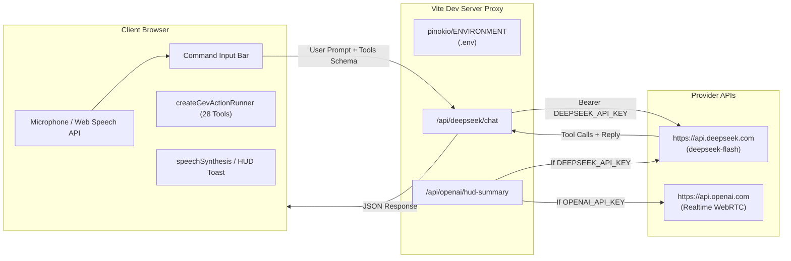

# God's Eye View: Multi-Provider AI & DeepSeek Integration Plan

## 1. Executive Summary & Problem Formulation

God's Eye View currently integrates AI through two distinct pathways:
1. **Realtime Voice Assistant (`GEV MIC`)**: An end-to-end multimodal speech-to-speech engine running over **WebRTC** (`api.openai.com/v1/realtime/calls`) using `gpt-realtime-2` or `gpt-realtime-2.1-mini`.
2. **Tactical HUD Summary**: A concise 5-word real-time readout generated via OpenAI's `/v1/responses` REST endpoint.

### The Problem
* The current voice integration is locked to OpenAI's proprietary WebRTC Realtime API.
* OpenAI Realtime audio tokens are expensive ($10–$64 per 1M tokens), resulting in approximately **$5.00 to $18.00 per active hour**.
* Users with **DeepSeek API keys** (`api.deepseek.com`), local LLMs (Ollama), or budget cloud providers (Groq, Gemini, Xiaomi MiLM) cannot currently use their preferred models for map control and intelligence summaries.

---

## 2. Cost Analysis & Provider Comparison

### A. Cost Matrix (Per 1,000,000 Tokens, USD)

| Provider & Model | Text Input | Cached Input | Text Output | Audio Input | Audio Output | Effective 1-Hr Voice/Interactive Session |
| :--- | :--- | :--- | :--- | :--- | :--- | :--- |
| **OpenAI Realtime Standard** (`gpt-realtime-2`) | $4.00 | $0.40 | $24.00 | $32.00 | $64.00 | **~$6.00 – $18.00 / hr** |
| **OpenAI Realtime Mini** (`gpt-realtime-2.1-mini`) | $0.60 | $0.06 | $2.40 | $10.00 | $20.00 | **~$1.80 – $5.40 / hr** |
| **OpenAI Chat** (`gpt-4o-mini`) | $0.15 | $0.075 | $0.60 | N/A | N/A | **~$0.01 – $0.03 / hr** (with Web Speech) |
| **DeepSeek-V4.1-Flash** (Off-Peak) | **$0.15** | **$0.003** | **$0.60** | N/A | N/A | **~$0.002 – $0.01 / hr** (with Web Speech) |
| **DeepSeek-V4.1-Flash** (Peak) | $0.30 | $0.006 | $1.20 | N/A | N/A | ~$0.004 – $0.02 / hr |
| **DeepSeek-V4-Pro** | Premium | Premium | Premium | N/A | N/A | Premium rate (with Web Speech) |
| **Groq** (`llama-3.1-8b-instant`) | **$0.05** | N/A | **$0.08** | N/A | N/A | **<$0.005 / hr** (Free tier available) |
| **Google Gemini 2.0 Flash** | $0.10 | $0.025 | $0.40 | $0.70 | $2.00 | **Free tier** / ~$0.02 / hr |
| **Xiaomi MiLM / Open Weights** (Self-hosted) | $0.00 | $0.00 | $0.00 | N/A | N/A | **Hardware electricity only** |

---

### B. DeepSeek vs. OpenAI Cost Breakdown for God's Eye View

1. **System Prompt & Tool Schemas**:
   * God's Eye View passes 28 tool definitions ([src/voice/gevActions.js](src/voice/gevActions.js)), totaling ~3,200 tokens.
   * **DeepSeek's Context Caching**: Because the system prompt and tool definitions are identical across turns, DeepSeek automatically caches this prefix.
   * Input cache hit cost on DeepSeek-V4.1-Flash (off-peak): **$0.003 / 1M tokens** (~$0.00001 per query).
   * Over 100 commands: DeepSeek-V4.1-Flash costs **~$0.001** (a fraction of a cent), whereas OpenAI Realtime costs **~$3.00 to $6.00**.

2. **HUD Summary Operations**:
   * HUD summary triggers periodically (camera position + active layers -> 5-word output).
   * Context payload: ~120 tokens; Output: ~10 tokens.
   * 1,000 HUD updates on OpenAI: ~$0.05 to $0.50.
   * 1,000 HUD updates on DeepSeek-V4.1-Flash: **<$0.001** (essentially free).

### C. Best Suitable Model Selection
Given the requirements of God's Eye View (fast JSON tool calling and rapid, small HUD summary generations), **`deepseek-flash`** (DeepSeek-V4.1-Flash) is the ideal default choice. Its blazing fast generation and ultra-cheap $0.003/1M cached token rate make it perfectly suited for high-frequency map interactions. We will use `deepseek-flash` as the default model, while leaving room for `deepseek-v4-pro` if deeper reasoning is requested by the user.

---

## 3. Feasibility & Architecture Decision

### Is It Worth Adding DeepSeek?
**YES, overwhelmingly worth adding.**
* **Cost Efficiency**: 99.9% cost reduction compared to OpenAI Realtime.
* **Flexibility**: Enables users who do not have OpenAI credits or whose countries restrict OpenAI access to use AI features with their existing DeepSeek key.
* **Architectural Realism**:
  * DeepSeek does **NOT** support WebRTC speech-to-speech.
  * Instead, we implement a **Decoupled Agent Architecture**:
    * **Voice Input (STT)**: Browser-native Web Speech API (`SpeechRecognition` / `webkitSpeechRecognition`) — runs client-side, zero latency, 0 cost.
    * **LLM Engine & Tool Calling**: DeepSeek (`deepseek-flash`) via an OpenAI-compatible proxy (`/api/openai/hud-summary` and `/api/ai/command`).
    * **Action Execution**: God's Eye View's existing `createGevActionRunner` (`src/voice/gevActions.js`).
    * **Voice Output (TTS)**: Browser-native `window.speechSynthesis` (or text toast in HUD) — zero latency, 0 cost.

---

## 4. Implementation Plan & Milestones

### Milestone 1: Key Management & Configuration
* **Files**:
  * `src/keySetupCore.mjs`: Add `deepseek` provider entry (`DEEPSEEK_API_KEY`, title: "DEEPSEEK", description: "DeepSeek-V4.1-Flash for AI commands & HUD summary", url: "https://platform.deepseek.com/api_keys").
  * `pinokio/ENVIRONMENT` & `.env.example`: Add `DEEPSEEK_API_KEY=` template.
  * `scripts/setup-doctor.mjs` & `scripts/pinokio-environment.mjs`: Add `DEEPSEEK_API_KEY` to validated environment variables.

### Milestone 2: DeepSeek-Powered HUD Summary
* **Files**:
  * `vite.config.js`:
    * Check for `DEEPSEEK_API_KEY`. If present and `OPENAI_API_KEY` is absent (or if explicitly selected), route `/api/openai/hud-summary` to `https://api.deepseek.com/chat/completions` using model `deepseek-flash`.
    * Formulate prompt for 5-word tactical summary.
  * Unit tests in `src/hudSummaryResponse.test.mjs`.

### Milestone 3: DeepSeek AI Command & Action Controller
* **Files**:
  * `vite.config.js`: Add proxy endpoint `/api/ai/command` or `/api/deepseek/chat` accepting `{ prompt, context, tools }`.
  * `src/voice/gevActions.js`: Export `GEV_REALTIME_TOOLS` schema in standard OpenAI tool calling format (`{ type: "function", function: { ... } }`).
  * `src/ai/deepseekController.js`:
    * Handles user request, calls DeepSeek with tool specifications.
    * Parses `tool_calls` returned by DeepSeek.
    * Executes each tool sequentially via `createGevActionRunner`.
    * Dispatches confirmation narration to `speechSynthesis` and HUD notifications.

### Milestone 4: Command Dock UI Integration
* **Files**:
  * `index.html` & `src/ui.js`:
    * Integrate an AI prompt shortcut (`/` or command input in `#command-dock`).
    * Allow toggle between OpenAI Realtime Voice and DeepSeek Assistant in Settings.
    * Wire Web Speech API mic dictation when in DeepSeek mode.

---

## 5. Security & Rate Limiting Guardrails

1. **Server-Side Key Isolation**: `DEEPSEEK_API_KEY` remains server-side only in `.env` / `pinokio/ENVIRONMENT`. It is never bundled into client JavaScript.
2. **Rate Limiter**: Implement `GEV_RATELIMIT_DEEPSEEK_PER_MIN` (default 60 req/min) in `vite.config.js` following the pattern of `GEV_RATELIMIT_OPENAI_PER_MIN`.
3. **Payload Sanitization**: Limit prompt sizes to 32 KB to prevent prompt injection or denial-of-service.
